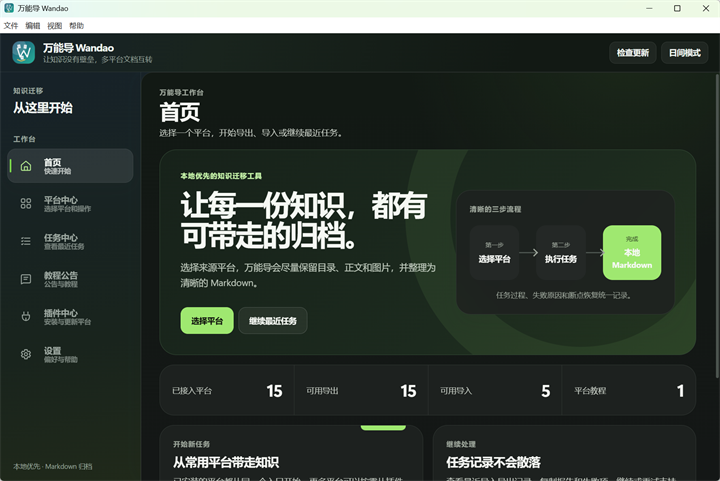
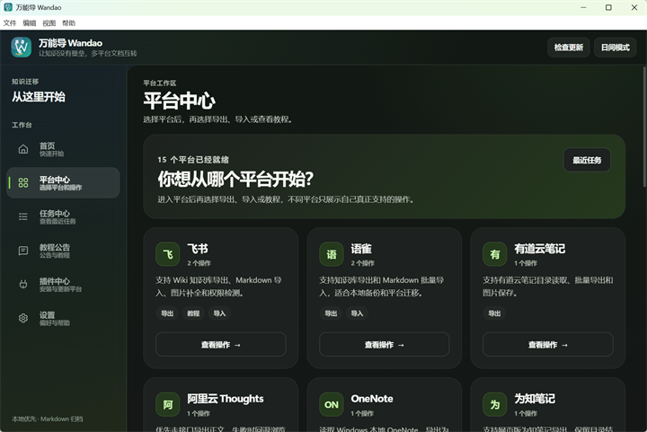
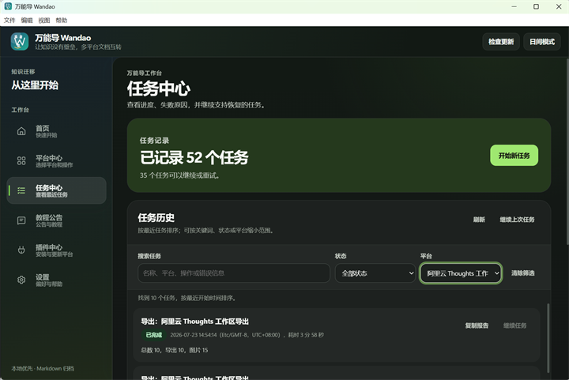
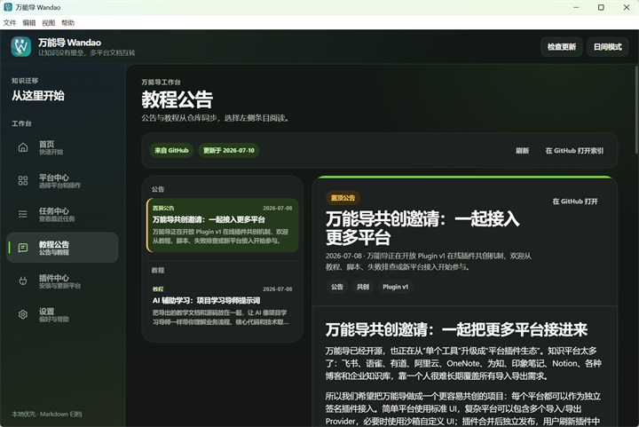
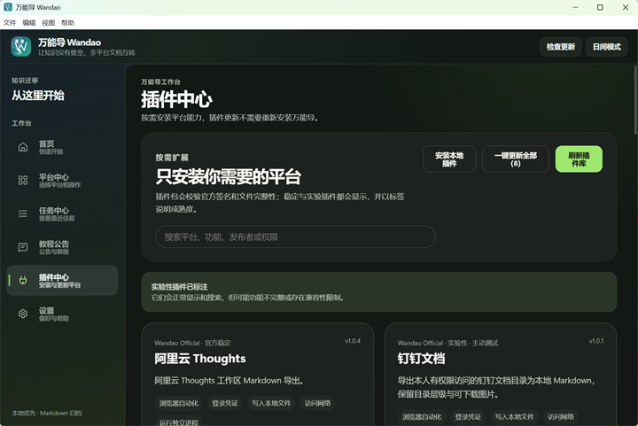
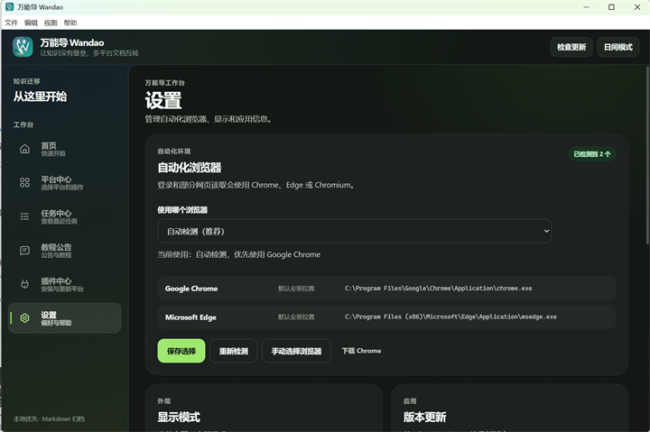

<p align="center">
  
</p>

<h1 align="center">万能导 Wandao ✨</h1>

<p align="center">
  <strong>让知识没有壁垒，让多平台文档迁移更简单。</strong>
</p>

<p align="center">
  将你有权访问的知识库导出为本地 Markdown，或把本地 Markdown 导入其他平台。<br>
  尽量保留目录结构、正文格式、图片与附件，告别重复复制和手动整理。
</p>

<p align="center">
  <a href="https://github.com/tllovesxs/wandao/releases"></a>
  <a href="https://github.com/tllovesxs/wandao/releases"></a>
  <a href="https://github.com/tllovesxs/wandao/stargazers"></a>
  <a href="https://github.com/tllovesxs/wandao/network/members"></a>
  <a href="https://github.com/tllovesxs/wandao/issues?q=is%3Aissue"></a>
  <a href="LICENSE"></a>
  
</p>

<p align="center">
  
  &nbsp;
  
  &nbsp;
  
  &nbsp;
  
</p>

<p align="center">
  <strong><a href="https://github.com/tllovesxs/wandao/releases">📦 下载最新版</a></strong>
  &nbsp;·&nbsp;
  <a href="docs/使用教程.md">📖 使用教程</a>
  &nbsp;·&nbsp;
  <a href="prompts/项目学习导师提示词.md">🧠 AI 辅助学习</a>
  &nbsp;·&nbsp;
  <a href="https://github.com/tllovesxs/wandao/issues">🐛 反馈问题</a>
  &nbsp;·&nbsp;
  <a href="docs/共创流程.md">🤝 参与共创</a>
</p>

万能导是一个多平台知识库 Markdown 导入导出工具，目前支持飞书、语雀、阿里云 Thoughts、印象笔记、有道云笔记、为知笔记、OneNote、知识星球、ima 知识库、钉钉文档、WPS 文档、息流、Obsidian、Notion 和本地 Markdown 等内容来源与目标平台。

你可以把自己有权限访问的项目资料、团队知识库和课程文档导出为本地 Markdown，也可以把整理好的本地 Markdown 导入到支持的平台。万能导重点处理文档格式、图片、附件和目录层级，适合知识备份、平台迁移、学习资料整理，以及将“教学文档 + 源码项目”交给 AI 一起阅读。

如果有未能完整导出的内容或希望支持的新平台，欢迎提交 [GitHub Issue](https://github.com/tllovesxs/wandao/issues)。建议新平台不要求参与开发，平台使用经验、公开资料和测试意愿同样有价值；每一条可复现的反馈和共创需求都会被认真审查。

如果这个项目对你有帮助，欢迎在 GitHub 点一个 Star ⭐,这对我真的很重要~

---

## 🖼️ 界面预览

<table>
  <tr>
    <td width="50%" align="center">
      <br>
      <sub>首页：选择平台、开始新任务或继续最近任务</sub>
    </td>
    <td width="50%" align="center">
      <br>
      <sub>平台中心：浏览已接入平台并选择导入、导出或教程</sub>
    </td>
  </tr>
  <tr>
    <td width="50%" align="center">
      <br>
      <sub>任务中心：查看历史进度、失败原因并继续任务</sub>
    </td>
    <td width="50%" align="center">
      <br>
      <sub>教程公告：在应用内阅读最新公告和使用教程</sub>
    </td>
  </tr>
  <tr>
    <td width="50%" align="center">
      <br>
      <sub>插件中心：搜索、安装和更新需要的平台插件</sub>
    </td>
    <td width="50%" align="center">
      <br>
      <sub>设置：选择自动化浏览器、显示模式并检查版本</sub>
    </td>
  </tr>
</table>

## ✨ 为什么使用万能导

| | 能力 | | 能力 |
| --- | --- | --- | --- |
| 🧭 | **目录结构**：读取真实目录树，按文件夹或文档选择 | 🖼️ | **资源本地化**：尽量保留正文图片和附件 |
| 🔁 | **任务恢复**：支持停止、继续和失败重试 | 📊 | **过程可见**：提供实时进度、日志和任务报告 |
| ⚡ | **增量处理**：跳过已完成内容，减少重复工作 | 🧩 | **插件中心**：平台能力可独立下载、更新和回滚 |
| 🔐 | **本地优先**：凭证和任务数据保存在用户电脑 | 🌙 | **桌面体验**：支持主题切换、搜索和更新检查 |

## 🚀 支持的平台

平台按导出、导入和教程三类展示；更多平台能力可在应用内“插件中心”获取。

### 导出

| 平台 | 主要能力 |
| --- | --- |
| 🌟 **知识星球** | 项目、专栏、帖子与文章页，可选评论和附件 |
| 🪶 **语雀** | 知识库、目录、Markdown、图片与附件 |
| 🪽 **飞书 Wiki** | Wiki 目录、原生文档和 Markdown 文件 |
| ☁️ **阿里云 Thoughts** | 工作区文档导出 |
| 🐘 **印象笔记** | 按笔记本导出 Markdown、图片和附件 |
| 📝 **有道云笔记** | 目录树、正文图片和附件 |
| 📒 **为知笔记** | 网页版登录、目录与图片 |
| 🗂️ **OneNote** | 保留笔记本、分区和页面层级，仅 Windows |
| 🤖 **ima 知识库** | 按知识库、文件夹或文档选择 |
| 📌 **钉钉文档** | 知识库目录读取与 Markdown 导出 |
| 🟥 **WPS 文档** | 云文档读取与 Markdown 导出 |
| 🌊 **息流** | 空间内容读取与 Markdown 导出 |
| 💎 **Obsidian** | 本地 Vault 归档、资源复制与引用重写 |
| ➕ **等更多平台** | 更多平台将通过插件中心持续接入 |

### 导入

| 平台 | 主要能力 |
| --- | --- |
| 🪽 **飞书 Wiki** | 批量导入 Markdown，并恢复多层目录结构 |
| 🪶 **语雀** | 创建或更新知识库文档，上传图片和附件 |
| 🐘 **印象笔记** | 批量导入 Markdown、图片和附件 |
| 🤖 **ima 知识库** | 上传本地文档到知识库或已有文件夹 |
| ➕ **等更多平台** | 更多导入能力将通过插件中心持续接入 |

### 教程

| 平台 | 主要能力 |
| --- | --- |
| ◼️ **Notion** | 使用官方 Markdown 导出与迁移能力 |
| ➕ **等更多平台** | 暂不适合自动化的平台也可以先提供迁移教程 |

## ⚡ 快速开始

1. 打开 [GitHub Releases](https://github.com/tllovesxs/wandao/releases)，下载 Windows x64 或 macOS Apple Silicon（arm64，macOS 11+）安装包
2. 启动 Wandao，在“平台中心”选择目标平台和导入/导出操作
3. 按界面提示登录或填写链接，然后读取目录
4. 勾选需要处理的文档并开始任务
5. 在“任务中心”查看进度、报告，或继续支持恢复的任务

发行版已内置运行环境，普通用户不需要安装 Python、Node.js，也不需要从源码启动。

> **macOS Apple Silicon 首次打开：** 当前正式 Release 未做 Developer ID 签名和 Apple 公证。请只从本项目 GitHub Releases 下载并移入“应用程序”；Gatekeeper 阻止时，可在“系统设置 → 隐私与安全性”确认来源后选择仍要打开。不要通过清除隔离属性绕过系统校验。

详细操作和平台注意事项请查看 [使用教程](docs/使用教程.md)。

<details>
<summary><strong>🧑‍💻 源码启动与本地开发</strong></summary>

源码启动适合参与开发、调试插件或当前没有合适发行版的情况。1.4.x 桌面端基于 Tauri 2；源码开发需要 Python 3.10+、Node.js 22.12+、Rust 1.88.0 和对应系统的 Tauri 前置依赖。

Windows：

```powershell
git clone https://github.com/tllovesxs/wandao.git
cd wandao
.\start-wandao.cmd
```

macOS：

```bash
git clone https://github.com/tllovesxs/wandao.git
cd wandao
chmod +x ./start-wandao.sh
./start-wandao.sh
```

国内网络环境可将仓库地址替换为 `https://gitee.com/shi-xiansong/wandao.git`。

</details>

---

<details>
<summary><strong>🛠️ 质量检查与打包</strong></summary>

提交代码或打包前运行完整质量检查：

```powershell
python scripts\quality_check.py
```

涉及 `wandao_electron/src-tauri/` 时，还需使用 Rust 1.88.0 运行格式、测试和 Clippy 门禁；CI 使用同一固定版本。

Windows 本地未签名 smoke 打包：

```powershell
cd wandao_electron
npm ci
npm run build:win:unsigned
```

本地与手动工作流生成的 `UNSIGNED-SMOKE` 包只能用于 smoke，不得直接发布。正式 `v*` tag 工作流当前也生成未签名 Windows/macOS 安装包，但会额外执行版本一致性、真实安装/资源 smoke、校验和、SBOM 和 provenance 门禁。更完整的维护说明见 [发布与回滚手册](docs/发布与回滚手册.md)。

</details>

---

## 🔐 使用与安全

万能导不会破解登录或绕过平台权限。请只处理你有权访问的内容，并遵守对应平台的服务条款和版权要求。不要将导出内容用于未获授权的传播、售卖或公开发布，也不要通过降低延迟进行高频请求。

登录凭证和任务数据保存在本机。请勿在 Issue、PR、截图或日志中公开 Cookie、账号密码、Token、API Key、App Secret 等敏感信息。

更多说明见 [合规说明](docs/合规说明.md)、[安全策略](SECURITY.md) 和 [本地数据存储策略](docs/本地数据存储策略.md)。

## 🤝 参与共创

欢迎参与新平台适配、导入导出质量优化、Bug 修复、界面改进和文档维护。不会开发也可以通过“新平台接入建议 / 共创认领”Issue 模板建议新平台。准备开发新平台或较大功能时，请先搜索已有 Issue/PR，再提交 Issue 认领；认领后 2 天内提交 Draft PR 或可验证进展，复杂任务需说明情况并至少每 2 天同步一次。

| 入口 | 用途 |
| --- | --- |
| [贡献指南](CONTRIBUTING.md) | 提交代码前需要了解的基本规则 |
| [共创流程](docs/共创流程.md) | 认领 Issue、准备验收材料和提交 PR |
| [插件开发与发布](docs/在线插件开发与发布.md) | 新平台插件结构、校验与发布方式 |
| [GitHub Issues](https://github.com/tllovesxs/wandao/issues) | 反馈 Bug、提出建议或认领功能 |

## 🔗 项目与联系

| 项目 | 地址 |
| --- | --- |
| GitHub | [tllovesxs/wandao](https://github.com/tllovesxs/wandao) |
| Gitee | [shi-xiansong/wandao](https://gitee.com/shi-xiansong/wandao) |
| 联系邮箱 | `tl200599@163.com` |
| 作者微信 | `pressure_spring` |

## 📈 Star History

<a href="https://www.star-history.com/?repos=tllovesxs%2Fwandao&type=timeline&legend=top-left">
  <picture>
    <source media="(prefers-color-scheme: dark)" srcset="https://api.star-history.com/chart?repos=tllovesxs/wandao&type=timeline&theme=dark&legend=top-left&sealed_token=FYov8ICwAHTQ9yd8BHf4G_wynvkxW-Cyn1u-3L0u8RY9cbp5rG9biTriQsVm3xPj7khQm5XFQc21HkiccNxo3OAQwnIzYbHAIgyVV8zrfDPEhtFZOAoj_g">
    <source media="(prefers-color-scheme: light)" srcset="https://api.star-history.com/chart?repos=tllovesxs/wandao&type=timeline&legend=top-left&sealed_token=FYov8ICwAHTQ9yd8BHf4G_wynvkxW-Cyn1u-3L0u8RY9cbp5rG9biTriQsVm3xPj7khQm5XFQc21HkiccNxo3OAQwnIzYbHAIgyVV8zrfDPEhtFZOAoj_g">
    
  </picture>
</a>

## 📄 License

本项目采用 [GNU Affero General Public License v3.0](LICENSE) 开源。

<p align="center">
  <strong>万能导：让知识没有壁垒。</strong><br>
  如果这个项目对你有帮助，欢迎在 GitHub 点一个 Star ⭐
</p>
